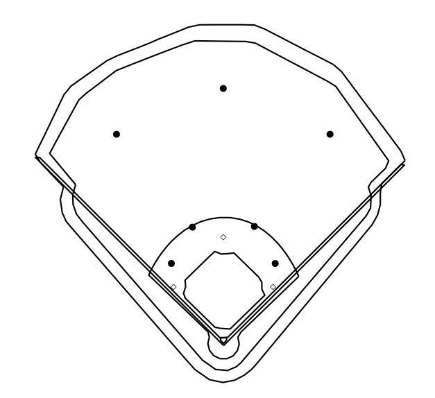

# Defensive Positioning
Optimizing defensive positioning with MLB Statcast data.
## Description
This repository contains code ('defensive_positioning.R') that uses data scraped from [Baseball Savant](baseballsavant.com) through [baseballr](https://billpetti.github.io/baseballr/index.html) along with defensive player coordinates provided by MLBAM that seeks to use the position of defensive players to predict the probability an observed batted ball is a hit. A gradient boosted model is used and the predicted probability of a hit is averaged by batter to find the batting average on balls in play (BABIP) for each batter with a given defenisve alignment.

The write-up for this project is in the workings and will be posted here when finished along with an accompanying R Shiny app.

## Example
Joey Gallo is known for his extreme tendancies of hitting the ball to his pull side and in the air. I will give an example of Gallo's predicted BABIP from all his batted balls between March 29, 2018 to June 27, 2021 on different defensive alignments.

### Standard

Gallo has a predicted BABIP of .312 if all his batted balls were hit with the standard defensive alignment shown above. 

### Infield Shift

Gallo's predicted BABIP goes does to .272 when I shift the fielders into the above defensive alignment.

### 4-Man Outfield with Infield Shift

With a 4-man outfield and infield shift, like the alignment above, Gallo's predicted BABIP is .306.

## Conclusion
Joey Gallo's tendancies over the last couple years show the defensive alignement against him can make a big difference in his success, even if the alignment is against the norm.
